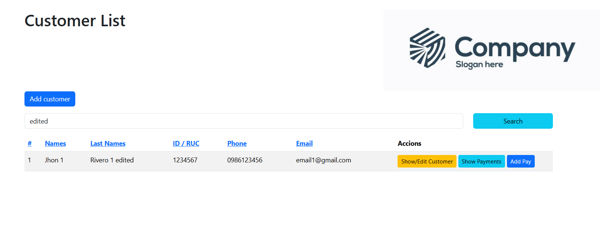

# Client Flow

Client Flow is an application designed to manage clients and automate the recording of payments due on a monthly basis. Built with AdonisJS version 7, it uses SQLite as database and is prepared to run on Node.js version 22.0.0.

## Prerequisites.

- Node.js\*\*: Make sure you have Node.js version 22.0.0 installed. You can check your current version with

  ```bash
  node -v
  ```

  If you need to install or update Node.js, download it from the [official website](https://nodejs.org/).

- SQLite\*\*: This application uses SQLite as database.

## Installation

1. **Clone the repository**:

   ```bash
   git clone https://github.com/jhonriv/client-flow.git
   cd client-flow
   ```

2. **Install the dependencies**:

   ```bash
   npm install
   ```

3. **Set the environment variables**:

   Copy the example file `.env.example` and rename it to `.env`.

   ```bash
   cp .env.example .env
   ```

   Make sure the settings in `.env` are correct, especially those related to the SQLite database.

## Using SQLite

The application is configured to use SQLite as the default database. No additional configuration is required if you are using SQLite. Make sure that the database file (`database.sqlite`) is present in the `database` folder or that the configuration in the `.env` file points correctly to its location.

## Database migrations

Before running the application, it is necessary to run the migrations to configure the database tables:

```bash
node ace migration:run
```

## Running the application

Once the database has been configured and the migrations have been executed, start the development server:

```bash
node ace serve --watch
```

The application will be available at `http://localhost:3333`.

## Scheduled tasks

Client Flow is designed to run scheduled tasks that automatically record payments due on a monthly basis. These tasks are configured using `node-cron` and run according to the schedule defined in the code. No additional configuration is required for this functionality.

## Contributions

If you wish to contribute to the development of Client Flow, please fork the repository, create a branch with your changes and submit a pull request for review.

## License

This project is licensed under the MIT License. See the `LICENSE` file for details.

---

For more information or support, please contact the lead developer.

## Screenshots

### Main Page


### Main page using filtering



### Add Customer


### Edit Customer


### Show Customer Payments


### Add new customer payment


### Edit Payment


